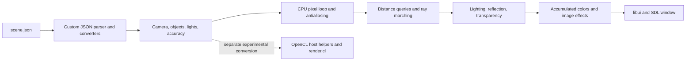

# RayTracer

A C graphics project that loads JSON scenes and renders them through CPU ray tracing and distance-based ray marching, with a separate OpenCL experiment in the source tree. This project was completed as part of the École 42 / School 21 curriculum. It was completed as a team project.

## Goal

Explore scene parsing, geometric representations, lighting, materials, and windowed image generation. The repository demonstrates these techniques through its implementation; no score, frame rate, acceleration measurement, or complete conformance to a particular assignment version is claimed.

The exact curriculum subject is **not verified**. See [subject investigation](docs/SUBJECT_NOT_VERIFIED.md). No `docs/subject.pdf` is attached because the evidence does not establish an exact version.

## Requirements

### Software

- A C compiler and GNU-compatible Make.
- macOS SDK frameworks: Cocoa, OpenGL, and OpenCL, referenced by the Makefile and headers.
- Autoconf for the bundled SDL `autogen.sh` step; the existing SDL configure/build requires the platform's development tools.
- Vendored `libs/libft`, `libs/libui`, and SDL source are retained. Do not delete them or substitute arbitrary prebuilt binaries.
- CMake 3.13 or later for investigating the separate CMake configuration.

The historical headers contain Intel-specific configuration. **The renderer does not currently build on the checked Apple Silicon environment.** A compatible historical Intel macOS environment is a likely restoration target, not a verified supported setup. The original SDK/compiler versions are **Not documented in the original repository**.

### Build

From the repository root, the primary build entry point documented here is:

```sh
make
```

The Makefile builds `libft`, configures/builds/installs vendored SDL within `libs/libui/SDL`, builds `libui`, compiles renderer sources, and targets `rtv1`. It is the most complete dependency workflow present; the original repository does not identify a canonical build system explicitly. After a failed configuration, the corrected rule leaves no success stamp, allowing the next attempt to retry.

The separate CMake attempt is:

```sh
cmake -S . -B build
cmake --build build
```

CMake expects existing libraries and does not build the bundled dependencies. Its SDL paths differ from the Makefile and its include paths omit `libs/libui/incs`. It is not a working clean-checkout alternative. See [build validation](docs/BUILD_VALIDATION.md) for observed failures, safe cleanup, and restoration steps.

### Running

Only after producing a working executable, run from the repository root:

```sh
./rtv1 scene.json
```

The supplied [scene.json](scene.json) defines a 300 × 300 scene, camera, direction, objects, lights, material settings, and rendering accuracy. These are input dimensions, not a measured hardware or performance specification. Preserve spellings such as `FOW` and `depth reflaction`, which the parser actually expects. Escape closes the window (`srcs/main.c`). No other application keyboard controls are registered there.

The program reads `argv[1]` without validating the argument count. Use only trusted, reviewed scenes. Image/texture paths resolve according to the scene and current directory. [ice_normals.bmp](ice_normals.bmp) is an existing texture asset, not a newly generated rendering screenshot. No runtime screenshot was generated because a renderer build did not succeed.

### Testing

```sh
python3 -m json.tool scene.json > /dev/null
make
cmake -S . -B build
cmake --build build
```

JSON syntax validation passed. The renderer has no project-specific automated regression suite identified in the reviewed tree; vendored SDL has its own tests, which are not renderer tests. Compilation and graphical runtime must be assessed separately. Neither renderer build nor graphical execution passed in the reviewed environment.

## Implementation

### Architecture



`srcs/main.c` initializes SDL/libui, parses the scene, and registers a tick callback. The callback invokes `ray_tracing`, which iterates over pixels, samples rays, accumulates colors, and applies effects. Distance functions, vector operations, and quaternion rotations supply the geometry used by the rendering pipeline.

### Geometry and Materials

The converter dispatch explicitly constructs spheres, planes, cylinders, cones, tori, boxes, capsules, ellipsoids, octahedra, hexagonal prisms, and triangular prisms. These have corresponding distance-function implementations. Other enum names alone do not establish usable primitives: for example, `mandelbub` is recognized by the name filter but has no corresponding constructor branch in `get_obj3`.

Source includes camera-direction quaternion transforms; ambient, directional, and point light types; shadow marching; reflection, refraction, and transparency code; BMP textures and normal maps; antialiasing samples; and sepia, negative, cartoon, stereoscopy, and motion-blur effects. These are source-level capabilities, not independently verified image-quality results.

### CPU and OpenCL Status

The default main path calls the CPU renderer. `srcs/ft_opencl_*` contains device/context creation, buffer transfers, kernel compilation, queue submission, and reads. `cl/render.cl` contains an experimental kernel and partly commented code. The Makefile omits the OpenCL host helper sources, whereas CMake lists them. No active call from the main program initializes or submits that kernel. OpenCL execution and any GPU speedup remain unverified; simply linking the OpenCL framework does not establish GPU rendering.

### Attribution and Contributions

The unchanged [author](author) file lists **hgreenfe** and **bturcott**. Source headers additionally credit **kmeera-r** and retain their original authorship lines. Git history records hgreenfe, Kodlak Meera reed, ragarg, Berta Turcotte, Dwhistle, Denis, macbook, and Андрей Шибаев; these names are preserved as recorded without inferring identity mappings or per-feature ownership. The relationship between `bturcott` and DWhistle/Andrey is **Not documented in the original repository**.

Vendored SDL source, embedded licenses, third-party notices, and [libft author](libs/libft/author) are preserved. No project-wide license was added or inferred from vendored library licenses.

## Conclusions

The source demonstrates how scene data, vector/quaternion geometry, distance functions, material calculations, and a graphical event loop fit together. It also shows an unfinished parallel-computing integration alongside the CPU path.

Current limitations include stale platform configuration, a blocked build, unchecked scene inputs, incomplete primitive dispatch, and an unvalidated OpenCL kernel. The scene color buffer allocates `w × w` entries while the renderer indexes `w × h`; rectangular scenes with `h > w` require a separate correctness fix. The supplied square scene avoids that specific size mismatch but does not establish general memory safety. No renderer behavior was changed to conceal these limitations.

## Topics Studied

- C memory and resource management
- JSON scene parsing and data structures
- Vector mathematics and quaternion transformations
- Ray traversal, signed-distance functions, and ray marching
- Lighting, shadows, reflections, refraction, and transparency
- Antialiasing, texture sampling, and image effects
- SDL event handling and windowed pixel output
- OpenCL buffers, kernels, and parallel-computing integration experiments
- Build systems and platform dependency management
